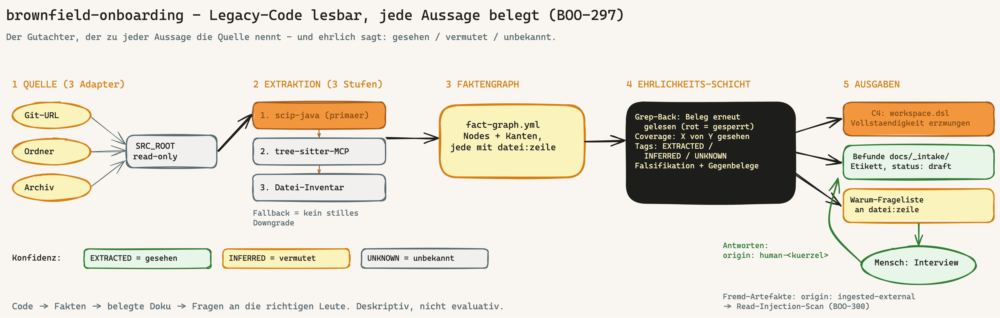

---
provenance:
  origin: ai-claude
  classification: open
  status: reviewed
---

# brownfield-onboarding

> Framework-Bundle-Skill — liest eine bestehende Java-Codebasis und erzeugt belegte Architektur-Befunde (Faktengraph + Rohbefund) mit Ehrlichkeits-Anspruch. Anlassfall: BOO-297 (2026-07-01).

**Version:** 1.5.0 · **Befehl:** `/brownfield-onboarding`

> **Neu in 1.5.0 (BOO-486):** explizites Profil-Lesen fuers Chunk-Tuning (Schritt 5.5) — existiert `.claude/model-profile.yml`, wird es dem `chunk_plan.py`-Lauf frisch per `--profile` mitgegeben; ohne Profil konservativer Fest-Default mit Ansage. Skript und Chunk-Disziplin (BOO-489) unveraendert.

> **Claude-Code-Modus:** `/brownfield-onboarding` liest die Quelle nur (read-only) und schreibt Befunde nach `docs/_intake/` + `journal/` → beaufsichtigt **`acceptEdits`**. Kein unbeaufsichtigter Betrieb. Details: HANDBUCH §6 „Claude-Code-Modus".

## Was der Skill tut

`brownfield-onboarding` nimmt eine bestehende, oft undokumentierte Codebasis (v1: **Java**) — als Git-URL, lokaler Ordner oder Archiv — und extrahiert daraus einen **Faktengraphen** (Pakete, Klassen, Abhaengigkeiten, je mit `datei:zeile`-Beleg). Die Extraktion machen deterministische Werkzeuge (primaer `scip-java`, Fallback `tree-sitter`, Minimal-Fallback Datei-Inventar); der Skill orchestriert, erzaehlt und kennzeichnet. Befunde landen in `docs/_intake/brownfield/`, jedes Dokument traegt das Dokument-Etikett (BOO-298).

> **Klartext:** Viele Werkzeuge lesen alte Software wie ein Gutachter, der einen schoen aussehenden Bericht abliefert — ohne zu belegen, woher jede Aussage kommt, und ohne zuzugeben, was er nicht geprueft hat. Dieser Skill ist der Gutachter, der zu jeder Aussage die Quelle nennt und ehrlich dazuschreibt: **gesehen / vermutet / weiss ich nicht.**



**Deskriptiv, nicht evaluativ:** Der Skill macht Legacy lesbar (was IST das System). Bewertung („gut/sicher/konform?") bleibt bei `/security-architect`, `/architecture-review`, `/dpo` und den Quality-Gates.

## Wann anwenden

- **Post-Bootstrap.** Skelett-Artefakte (CLAUDE.md / AGENTS.md / CONVENTIONS.md) existieren.
- Ein Bestandssystem wird uebernommen: Code da, Architektur-Doku fehlt oder ist nicht verifizierbar.
- **Trigger:** `/brownfield-onboarding`, oder Phase-7.6-Hinweis nach Bootstrap, wenn Bestands-Code erkannt wurde.

## Nutzung (Kurz)

```
/brownfield-onboarding
  -> Quelle waehlen (Git-URL / Ordner / Archiv)
  -> Pre-Flight (Projekt-Root, Bootstrap-Spur, classification-Default)
  -> Stack-Erkennung (v1: nur Java — sonst ehrliche Ablehnung, kein Konfidenz-Theater)
  -> Faktenextraktion (scip-java -> tree-sitter -> Datei-Inventar; Stufe wird benannt)
  -> Faktengraph: docs/_intake/brownfield/fact-graph.yml
  -> Befunde mit Konfidenz-Tags (EXTRACTED/INFERRED/UNKNOWN) + Beleg-Register claims.yml
  -> Grep-Back (deterministisch): jeder Beleg wird an der Quelle rueckgeprueft
  -> Coverage-Register (deterministisch): "X von Y gesehen" nach coverage.yml
  -> Falsifikations-Pass: Vermutungen gegen den Graph angreifen, Widersprueche melden
  -> C4-Ausgabe: workspace.dsl (C1-C3, selbst erzeugt) + c4-map.yml;
     Vollstaendigkeits-Check erzwungen; Rendering via Structurizr-MCP optional
  -> Warum-Luecken-Kompass (interaktiv): minen -> Luecken markieren -> priorisierte
     Frageliste -> Interview; Antworten origin: human-<kuerzel>, Fremd-Artefakte
     origin: ingested-external (+ BOO-300-Hinweis)
```

## Ehrlichkeits-Prinzipien

1. Keine Aussage ohne Claim: EXTRACTED mit `datei:zeile`-Beleg + bestandenem Grep-Back; INFERRED mit Stuetz-Fakten + Falsifikations-Pass; sonst UNKNOWN.
2. Kein stilles Downgrade — die tatsaechlich gelaufene Extraktor-Stufe steht in jedem Output, inklusive ihrer Grenzen.
3. Luecken werden gezaehlt (Coverage-Register), nicht glattgebuegelt; Ghost-Eintraege im Graph sind Fabrikations-Verdacht und machen den Lauf rot.
4. Quelle bleibt read-only; Artefakte entstehen nur im Projekt.
5. Etikett-Pflicht: `origin: ai-claude`, `status: draft`, `confidence` = niedrigster Tag des Dokuments.
6. Rosinenpickerei-Schutz: Gegenbelege werden mitgesucht und mitgenannt — verschwiegene Gegenbelege wiegen wie ein gescheiterter Grep-Back.

Details + Schemas: [references/honesty-layer.md](references/honesty-layer.md) (SSoT).

## Ausbaustufen (Epic BOO-297)

| Stufe | Inhalt | Status |
|---|---|---|
| v0.1.x | Geruest, 3 Adapter, Java-Extraktion, Faktengraph, Rohbefund | ausgeliefert (Phase 1) |
| v0.2.x | Ehrlichkeits-Schicht: Grep-Back, Coverage-Register, EXTRACTED/INFERRED/UNKNOWN, Falsifikations-Pass | ausgeliefert (Phase 2) |
| v0.3.x | C4 selbst erzeugt: Faktengraph → Structurizr-DSL, Rendering via MCP, Vollstaendigkeit erzwungen | ausgeliefert (Phase 3) |
| v1.0 | Warum-Luecken-Kompass + interaktives Interview (Herkunfts-Tagging) | ausgeliefert |
| v1.1 (BOO-301) | C/C++-Embedded-Pfad: SVN-Adapter, `compile_commands.json`-Wahrheit, Hardware-Anti-Fabrikation | ausgeliefert |
| v1.2 (BOO-475) | Offline-C4-Render (Schritt 10b): `render_c4_local.sh` → Mermaid + Obsidian-Note, kein Docker/kein MCP noetig | ausgeliefert |
| v1.3 (BOO-489) | Autark-Modus (Pre-Flight ohne Bootstrap-Spur → Warnung) + Map-Reduce-Chunk-Disziplin (Schritt 5.5): `chunk_plan.py` sliced den Faktengraphen modulweise mit lokalem Token-Budget → Repos groesser als das effektive Fenster, modell-agnostisch (Epic BOO-483) | ausgeliefert |
| v1.4 (BOO-490) | Doku-Qualitätsrubrik (`doc-quality-rubric.md`, SSoT): Zielgruppen-Gate (kein stiller Skip), Fakt-plus-Bedeutung, Zeilennummer-/Zahlenwert-Ehrlichkeit, Anti-Pattern-Liste + Gold-Standard-Few-Shot-Slot → inhaltliche Modul-Doku-Qualität erzwingbar (Epic BOO-483) | dieses Release |

## Verzahnung

- `/knowledge-onboarding` — Geschwister-Skill fuer Bestands-**Doku**; zusammen entsteht der Gap-Report „wo widerspricht die Alt-Doku dem Code-Befund".
- `/architecture-review` — evaluatives Review, laeuft **nach** dem Befund.
- CONVENTIONS §Dokument-Etikett (BOO-298) — Herkunfts-Kennzeichnung aller Befunde.

## Dateistruktur

```
brownfield-onboarding/
├── SKILL.md / SKILL.en.md            # Workflow (11 Schritte), Anti-Fabrikations-Regeln
├── README.md / README.en.md          # diese Datei
├── overview.excalidraw / overview.png            # Uebersichts-Sketch (DE)
├── overview.en.excalidraw / overview.en.png      # Uebersichts-Sketch (EN)
├── scripts/
│   ├── grep_back.py                  # Belege an der Quelle rueckpruefen (Exit 1 = rot)
│   ├── coverage_register.py          # Closed-World-Zaehlung -> coverage.yml
│   ├── c4_completeness.py            # Diagramm gegen Faktengraph erzwingen (Exit 1 = rot)
│   ├── render_c4_local.sh            # Offline-C4-Render: DSL -> Mermaid + Obsidian-Note (BOO-475)
│   └── chunk_plan.py                 # Faktengraph -> Modul-Chunk-Plan (Token-Budget, Split) (BOO-489)
└── references/
    ├── fact-graph-schema.md/.en.md   # SSoT Faktengraph-Schema
    ├── java-extraction.md/.en.md     # scip-java + Fallback-Stufen
    ├── honesty-layer.md/.en.md       # SSoT Ehrlichkeits-Schicht (Claims, Tags, Falsifikation)
    ├── c4-structurizr.md/.en.md      # SSoT C4-Ausgabe (Mapping, DSL-Template, Sidecar)
    ├── why-gap-compass.md/.en.md     # SSoT Warum-Luecken-Kompass + Interview
    ├── doc-quality-rubric.md/.en.md  # SSoT Doku-Qualitätsrubrik (Zielgruppen-Gate, Anti-Patterns) (BOO-490)
    └── gold-standard/                # Few-Shot-Slot für abgenommene Beispiele (aktuell leer; §5 Ersatz) (BOO-490)
```

## Quellen

- Spec: `specs/BOO-297.md` · Runbook: `docs/runbooks/brownfield-onboarding.md`
- Evidenz (dreifach trianguliert): SecondBrain `04 Ressourcen/Research/2026-07-01 Brownfield-Code-Onboarding.md` + `2026-07-02 Tribal-Knowledge-Warum-Legacy.md`
- SCIP/scip-java: sourcegraph.com/blog/announcing-scip · sourcegraph.github.io/scip-java
