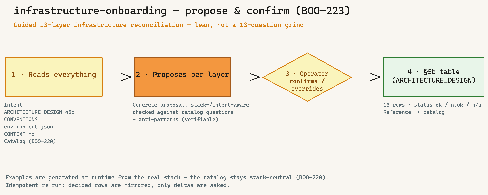

---
provenance:
  origin: ai-claude
  classification: open
  status: reviewed
name: infrastructure-onboarding
recommended_model: opus  # BOO-84 — tier mapping in bootstrap/references/model-tiers.json
language: en
description: |
  Guided 13-layer infrastructure reconciliation (propose-and-confirm). First reads what the project
  already describes (intent, ARCHITECTURE_DESIGN §5b, CONVENTIONS, environment.json, CONTEXT.md, catalog),
  then proposes one concrete decision per layer (stack-/intent-aware, against the catalog's mandatory
  questions + anti-patterns), the operator confirms/overrides, and it writes the §5b table. Idempotent
  re-run. Use when the operator wants to decide or update a project's infra layers. Triggers:
  "/infrastructure-onboarding", "go through the infra layers", "fill the 13 layers".
version: 1.0.0
metadata:
  hermes:
    category: onboarding
    tags: [infra-layer, propose-and-confirm, architecture, anti-fabrikation, docs-as-code]
    requires_toolsets: [terminal, git]
    related_skills: [intent, ideation, architecture-review, cloud-system-engineer, knowledge-onboarding]
---

# Infrastructure Onboarding

Decide the **13-layer infrastructure catalog** (BOO-220) for a concrete project — guided, but lean. Not an empty 13-question form: the skill **first reads everything the project already describes**, then makes **one concrete proposal per layer** from the role of an experienced architect. The operator **confirms** or **overrides**. The result lands in the **§5b infra-layer table** of `ARCHITECTURE_DESIGN.md` (BOO-221).



## When to use this skill

- **Post-bootstrap**, when `ARCHITECTURE_DESIGN.md` with the **§5b table** exists (BOO-221).
- The operator (possibly with an enterprise architect) wants to **decide the 13 infra layers once** — or **update** them after a stack/scope change.
- Operator trigger: explicit `/infrastructure-onboarding`, or bootstrap §7.6 point 10 emitted the hint.

**Not** the right skill for (three moments, three tools):

| Moment | Tool |
|---|---|
| **One-time / updated full reconciliation** of the 13 layers | **this skill** |
| Per-feature decision (a story touches a layer), ongoing/lazy | `/ideation` (`change_type: infrastructure`) |
| Recurring drift check (find open/deviating layers) | `/architecture-review` (§5b) |
| Concrete VPS operations/hardening check (SSH, Docker, firewall) | `/cloud-system-engineer` |

## Read list (MANDATORY — before every proposal)

The skill **never** proposes without reading first. Sources (graceful skip when missing, with a note — **do not invent**):

| Source | What it provides | If missing |
|---|---|---|
| `intents/INTENT-XX.md` (`/intent` output) | What is being built, why | Proposal from stack only — emit a note |
| `ARCHITECTURE_DESIGN.md` (§5b + §5) | Current blueprint, 13-layer table, quality axis | **Stop** — "run `/bootstrap`/BOO-221 first" |
| `CONVENTIONS.md` + `.claude/environment.json` | Language/runtime/stack/tools (`tools_available.*`, `paths.*`, `governance_mode`) | Assume defaults + note |
| `CONTEXT.md` | Project vocabulary/domain | Skip without warning |
| `cloud-system-engineer/references/infrastructure-dimensions.en.md` (catalog, BOO-220) | Mandatory questions + anti-patterns per layer = the cheat sheet | **Stop** — the catalog is a prerequisite |

## Workflow (8 steps)

### Step 1: Pre-flight + load the read list

1. Validate the project root (`pwd`, `ls -la`).
2. **Check the §5b table:** does the "§5b infra layers" section exist in `ARCHITECTURE_DESIGN.md`? If not → stop with the note "template without §5b — re-run `/bootstrap` or pull the BOO-221 migration".
3. **Check the catalog:** is `cloud-system-engineer/references/infrastructure-dimensions.en.md` present? If not → stop "catalog missing (BOO-220)".
4. Load the read list (above). Name missing optional files in the output.

### Step 2: Build the stack/intent profile

From `environment.json` (stack/runtime/tools), `CONVENTIONS.md` (runtime, `governance_mode`), the intent + `CONTEXT.md`, distill a **compact profile** — the basis for concrete proposals. Example:

```
Profile: public SaaS · Node/TypeScript + PostgreSQL · Vercel hosting · EU region · solo operator ·
         governance_mode: standard · intent: "self-service contract assistant, < 5 min turnaround"
```

Show the profile to the operator and have it confirmed ("Right, or is something missing?"). **No invented facts** — only what is in the sources; mark unknowns as `?`.

### Step 3: Read the §5b table (idempotency anchor)

Read the existing 13-row table. Determine the status per layer:

- **`ok` / `n/a (deliberate)`** → **mirror**, don't re-propose. In step 4 show only as "already decided: X — change? [no/change]" (delta question).
- **`n.ok` / empty** → make a **fresh proposal** in step 4.

This keeps the re-run idempotent: no full re-run, no duplicate questions.

### Step 4: Propose per layer


For each layer with status `n.ok`/empty: combine **catalog mandatory question(s) + anti-patterns** (from the catalog) **+ stack/intent profile** into **one concrete proposal**. Format per layer:

```
Layer 2 — APIs & Backend
  Proposal: REST + OpenAPI contract, versioned /v1, auth at the gateway.
  Checks against: catalog mandatory question "API contract/versioning?" + anti-pattern "versionless API coupling".
  ⚠️ Avoid: versionless API coupling (frontend+backend without an explicit contract).
  Fits? [confirm / change / n/a (deliberate) / later]
```

**Mandatory:** every proposal names the **catalog question/the anti-pattern** it checks against — this makes the model's judgment verifiable, not a gut feeling. For layers with a §5 cross-reference (security/monitoring/reliability), point to the matching §5 dimension instead of duplicating.

### Step 5: Confirm / override (operator gate)

Per proposal the operator decides:

- **confirm** → the proposal becomes `Decision`, status `ok`.
- **change** → the operator gives the decision (1 sentence), status `ok`.
- **n/a (deliberate)** → the operator gives a one-sentence rationale, status `n/a (deliberate)`.
- **later** → the row stays `n.ok` (lazy-fill, `/architecture-review` finds it again).

Batch allowed ("confirm 1-8, layer 9 n/a"). **No auto-apply** — writing only happens after confirmation.

### Step 6: Write the §5b table

Write only the **confirmed** rows back into the §5b table of `ARCHITECTURE_DESIGN.md` — exactly its format: `| # | Layer | Decision (1 sentence) | Status | Reference |`. The "Reference" column keeps pointing to the catalog (`infrastructure-dimensions.en.md §layer`), plus the sub-MD on depth (step 7). **§5 (quality) is not touched.**

**Runtime examples stay here** — the concrete product names/configs live only in the project table (or sub-MD), **never** back in the stack-neutral catalog (BOO-220).

### Step 7: On-demand sub-MD skeleton

If a layer decision needs **depth** (e.g. data model, IAM policy, recovery plan) and the operator wants it: create a **generic sub-MD skeleton** (`DB_SCHEMA.md` / `IAM_POLICY.md` / `RECOVERY_PLAN.md` etc., with skeleton frontmatter + headings) and link to it from the §5b "Reference" column. **No scaffolding upfront** — only where needed, only on request.

### Step 8: Wrap-up + coverage

Output to the operator:

```
Infra-layer reconciliation (as of <date>)

Decided (ok):     9 layers
Deliberate n/a:   2 layers (layer 8 rate limiting, layer 13 audit/SLA — no customer contract)
Open (n.ok):      2 layers (layer 4 caching, layer 11 monitoring — later)
New sub-MDs:      1 (DB_SCHEMA.md — skeleton created)

Written to: ARCHITECTURE_DESIGN.md §5b
Re-run any time: /infrastructure-onboarding (mirrors the decided ones, asks only deltas).
/architecture-review also finds open layers.
```

**Corporate level (optional):** if the decisions should apply group-wide, write into the **forked catalog** (inheritance mechanics, catalog section "inheritance mechanics") instead of only the project table — the shared catalog is only maintained at the framework/corporate level.

## Idempotent re-run

1. Step 3 reads the §5b table **first**.
2. `ok`/`n/a` rows are **mirrored** — a delta question instead of a new proposal.
3. Only `n.ok`/empty rows get a fresh proposal.
4. A stack change (new `environment.json` profile) → the skill flags affected layers ("stack is now multi-region — re-assess layer 6 Cloud & Compute?").

## Anti-fabrication — binding rules

1. **No proposal without a read source.** Proposals derive **only** from the actually-read files + catalog mandatory questions. No invented stack facts; mark unknowns as `?` and ask.
2. **Name a missing read-list file explicitly**, don't guess (step 1).
3. **Every proposal names the catalog question/the anti-pattern** it checks against — verifiable, not a model gut feeling.
4. **The operator always confirms before writing** to the table. No auto-apply.
5. **Runtime examples never go into the catalog.** The catalog stays stack-neutral (BOO-220); concrete examples live only in the project table/sub-MD.

## Interplay with other skills

| Skill | Role |
|---|---|
| `cloud-system-engineer` (catalog BOO-220) | provides the stack-neutral 13-layer cheat sheet (mandatory questions + anti-patterns). |
| `/ideation` (`change_type: infrastructure`) | per-feature hint on open layers (lazy). This skill is the **full reconciliation**. |
| `/architecture-review` | recurringly finds open/deviating §5b rows (drift). |
| `/intent` | the intent statement is input for the stack-/scope-aware proposals. |
| `knowledge-onboarding` | sibling skill (same pattern: read → propose → operator confirms → artifact). |

## References

- Catalog (SSoT of questions/anti-patterns): [`cloud-system-engineer/references/infrastructure-dimensions.en.md`](../cloud-system-engineer/references/infrastructure-dimensions.en.md)
- §5b table format: `bootstrap/references/architecture-design-template.en.md` (BOO-221)
- HANDBUCH **Appendix AR** "Infra-layer onboarding — the second architecture axis"
- Spec: `specs/BOO-223.md` · clarification note: SecondBrain `02 Projekte/Code-Crash Framework/Decisions/2026-06-18 Infrastruktur-Layer-Verankerung — 13-Layer-Raster (BOO-217).md`
</content>
