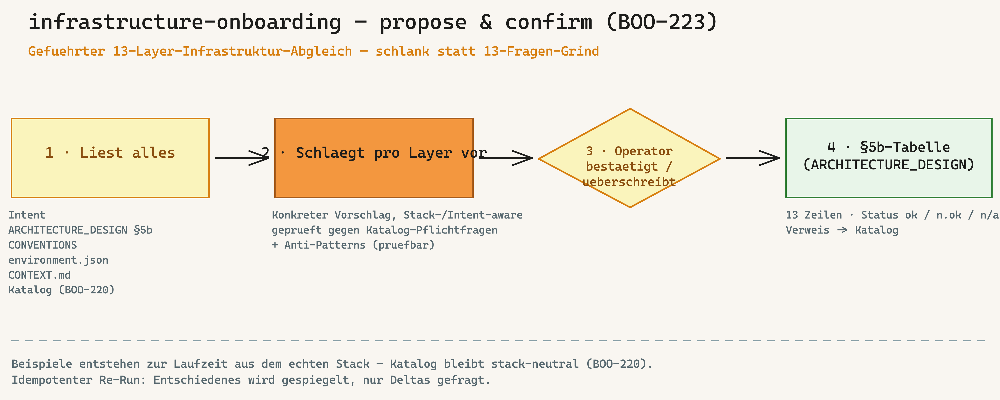

---
provenance:
  origin: ai-claude
  classification: open
  status: reviewed
name: infrastructure-onboarding
recommended_model: opus  # BOO-84 — tier mapping in bootstrap/references/model-tiers.json
description: |
  Gefuehrter 13-Layer-Infrastruktur-Abgleich (propose-and-confirm). Liest zuerst, was das
  Projekt schon beschreibt (Intent, ARCHITECTURE_DESIGN §5b, CONVENTIONS, environment.json,
  CONTEXT.md, Katalog), schlaegt dann pro Layer einen konkreten Vorschlag vor (Stack-/Intent-aware,
  gegen Katalog-Pflichtfragen + Anti-Patterns), Operator bestaetigt/ueberschreibt, schreibt die
  §5b-Tabelle. Idempotenter Re-Run. Verwenden wenn der Operator die Infra-Layer eines Projekts
  einmalig entscheiden oder nachfuehren will. Ausloeser: "/infrastructure-onboarding",
  "Infra-Layer durchgehen", "13 Layer fuellen".
version: 1.0.0
metadata:
  hermes:
    category: onboarding
    tags: [infra-layer, propose-and-confirm, architecture, anti-fabrikation, docs-as-code]
    requires_toolsets: [terminal, git]
    related_skills: [intent, ideation, architecture-review, cloud-system-engineer, knowledge-onboarding]
---

# Infrastructure-Onboarding

Den **13-Layer-Infrastruktur-Katalog** (BOO-220) fuer ein konkretes Projekt entscheiden — gefuehrt, aber schlank. Kein leerer 13-Fragen-Bogen: der Skill **liest zuerst alles, was das Projekt schon beschreibt**, und macht dann **pro Layer einen konkreten Vorschlag** aus der Rolle eines erfahrenen Architekten. Operator **bestaetigt** oder **ueberschreibt**. Ergebnis landet in der **§5b Infra-Layer-Tabelle** des `ARCHITECTURE_DESIGN.md` (BOO-221).



## Wann diesen Skill nutzen

- **Post-Bootstrap**, das `ARCHITECTURE_DESIGN.md` mit der **§5b-Tabelle** existiert (BOO-221).
- Der Operator (ggf. mit Enterprise-Architekt) will die 13 Infra-Layer **einmalig entscheiden** — oder nach Stack-/Scope-Aenderung **nachfuehren**.
- Operator-Trigger: explizit `/infrastructure-onboarding`, oder Bootstrap §7.6 Punkt 10 hat den Hinweis ausgegeben.

**Nicht** der richtige Skill fuer (drei Momente, drei Werkzeuge):

| Moment | Werkzeug |
|---|---|
| **Einmaliger / nachgefuehrter Voll-Abgleich** der 13 Layer | **dieser Skill** |
| Pro-Feature-Entscheid (Story beruehrt einen Layer), laufend/lazy | `/ideation` (`change_type: infrastructure`) |
| Wiederkehrender Drift-Check (offene/abweichende Layer finden) | `/architecture-review` (§5b) |
| Konkrete VPS-Betriebs-/Haertungs-Pruefung (SSH, Docker, Firewall) | `/cloud-system-engineer` |

## Lese-Liste (PFLICHT — vor jedem Vorschlag)

Der Skill schlaegt **nie** vor, ohne vorher zu lesen. Quellen (graceful skip bei Fehlen, mit Hinweis — **nicht erfinden**):

| Quelle | Was sie liefert | Bei Fehlen |
|---|---|---|
| `intents/INTENT-XX.md` (`/intent`-Output) | Was wird gebaut, warum | Vorschlag nur aus Stack — Hinweis ausgeben |
| `ARCHITECTURE_DESIGN.md` (§5b + §5) | Bisheriger Bauplan, 13-Layer-Tabelle, Qualitaets-Achse | **Stop** — „erst `/bootstrap`/BOO-221" |
| `CONVENTIONS.md` + `.claude/environment.json` | Sprache/Runtime/Stack/Tools (`tools_available.*`, `paths.*`, `governance_mode`) | Defaults annehmen + Hinweis |
| `CONTEXT.md` | Projekt-Vokabular/Domaene | Skip ohne Warnung |
| `cloud-system-engineer/references/infrastructure-dimensions.md` (Katalog, BOO-220) | Pflichtfragen + Anti-Patterns je Layer = der Spickzettel | **Stop** — Katalog ist Voraussetzung |

## Workflow (8 Schritte)

### Schritt 1: Pre-Flight + Lese-Liste laden

1. Projekt-Root validieren (`pwd`, `ls -la`).
2. **§5b-Tabelle pruefen:** existiert der Abschnitt „§5b Infra-Layer" im `ARCHITECTURE_DESIGN.md`? Wenn nein → Stop mit Hinweis „Template ohne §5b — `/bootstrap` re-rennen oder BOO-221-Migration ziehen".
3. **Katalog pruefen:** `cloud-system-engineer/references/infrastructure-dimensions.md` vorhanden? Wenn nein → Stop „Katalog fehlt (BOO-220)".
4. Die Lese-Liste laden (oben). Fehlende optionale Dateien im Output benennen.

### Schritt 2: Stack-/Intent-Profil bilden

Aus `environment.json` (Stack/Runtime/Tools), `CONVENTIONS.md` (Runtime, `governance_mode`), Intent + `CONTEXT.md` ein **kompaktes Profil** destillieren — die Basis fuer konkrete Vorschlaege. Beispiel:

```
Profil: oeffentliche SaaS · Node/TypeScript + PostgreSQL · Vercel-Hosting · EU-Region · Solo-Operator ·
        governance_mode: standard · Intent: „Self-Service-Vertrags-Assistent, < 5 Min Durchlaufzeit"
```

Das Profil dem Operator zeigen und bestaetigen lassen („Stimmt das, oder fehlt etwas?"). **Keine erfundenen Fakten** — nur, was in den Quellen steht; Unbekanntes als `?` markieren.

### Schritt 3: §5b-Tabelle lesen (Idempotenz-Anker)

Die bestehende 13-Zeilen-Tabelle einlesen. Pro Layer den Status feststellen:

- **`ok` / `n/a (bewusst)`** → **spiegeln**, nicht neu vorschlagen. In Schritt 4 nur als „bereits entschieden: X — aendern? [nein/aendern]" zeigen (Delta-Frage).
- **`n.ok` / leer** → in Schritt 4 einen **frischen Vorschlag** machen.

So bleibt der Re-Run idempotent: kein Voll-Neulauf, keine Doppel-Fragen.

### Schritt 4: Pro Layer Vorschlag (propose)


Fuer jeden Layer mit Status `n.ok`/leer: **Katalog-Pflichtfrage(n) + Anti-Patterns** (aus dem Katalog) **+ Stack-/Intent-Profil** zu **einem konkreten Vorschlag** verbinden. Format pro Layer:

```
Layer 2 — APIs & Backend
  Vorschlag: REST + OpenAPI-Vertrag, versioniert /v1, Auth am Gateway.
  Prueft gegen: Katalog-Pflichtfrage „API-Vertrag/Versioning?" + Anti-Pattern „versionsloses API-Coupling".
  ⚠️ Vermeide: versionsloses API-Coupling (Frontend+Backend ohne expliziten Vertrag).
  Passt das? [bestaetigen / aendern / n/a (bewusst) / spaeter]
```

**Pflicht:** Jeder Vorschlag nennt die **Katalog-Frage/das Anti-Pattern**, gegen das er prueft — das macht das Modell-Urteil pruefbar, kein Bauchgefuehl. Bei Layern mit §5-Querverweis (Security/Monitoring/Reliability) auf die passende §5-Dimension verweisen statt zu doppeln.

### Schritt 5: Confirm / Override (Operator-Gate)

Pro Vorschlag entscheidet der Operator:

- **bestaetigen** → Vorschlag wird `Entscheidung`, Status `ok`.
- **aendern** → Operator gibt die Entscheidung vor (1 Satz), Status `ok`.
- **n/a (bewusst)** → Operator nennt eine Ein-Satz-Begruendung, Status `n/a (bewusst)`.
- **spaeter** → Zeile bleibt `n.ok` (Lazy-Fill, `/architecture-review` findet sie wieder).

Batch erlaubt („bestaetige 1-8, Layer 9 n/a"). **Kein Auto-Apply** — erst nach Bestaetigung wird geschrieben.

### Schritt 6: §5b-Tabelle schreiben

Nur die **bestaetigten** Zeilen in die §5b-Tabelle des `ARCHITECTURE_DESIGN.md` zurueckschreiben — exakt deren Format: `| # | Layer | Entscheidung (1 Satz) | Status | Verweis |`. Die „Verweis"-Spalte zeigt weiter auf den Katalog (`infrastructure-dimensions.md §Layer`), bei Tiefe zusaetzlich auf das Sub-MD (Schritt 7). **§5 (Qualitaet) wird nicht angefasst.**

**Laufzeit-Beispiele bleiben hier** — die konkreten Produktnamen/Configs stehen nur in der Projekt-Tabelle (bzw. Sub-MD), **nie** zurueck im stack-neutralen Katalog (BOO-220).

### Schritt 7: On-demand Sub-MD-Skelett

Wenn eine Layer-Entscheidung **Tiefe** braucht (z.B. Datenmodell, IAM-Policy, Recovery-Plan) und der Operator es will: ein **generisches Sub-MD-Skelett** anlegen (`DB_SCHEMA.md` / `IAM_POLICY.md` / `RECOVERY_PLAN.md` o.ae., mit Skelett-Frontmatter + Ueberschriften) und aus der §5b-„Verweis"-Spalte darauf verlinken. **Kein Vorbau** — nur wo nötig, nur auf Wunsch.

### Schritt 8: Abschluss + Coverage

Output an den Operator:

```
Infra-Layer-Abgleich (Stand: <datum>)

Entschieden (ok):     9 Layer
Bewusst n/a:          2 Layer (Layer 8 Rate Limiting, Layer 13 Audit/SLA — kein Kundenvertrag)
Offen (n.ok):         2 Layer (Layer 4 Caching, Layer 11 Monitoring — spaeter)
Neue Sub-MDs:         1 (DB_SCHEMA.md — Skelett angelegt)

Geschrieben in: ARCHITECTURE_DESIGN.md §5b
Re-Run jederzeit: /infrastructure-onboarding (spiegelt Entschiedenes, fragt nur Deltas).
Offene Layer findet auch /architecture-review.
```

**Unternehmens-Ebene (optional):** Sollen die Entscheide konzernweit gelten, in den **geforkten Katalog** schreiben (Vererbungs-Mechanik, Katalog-Sektion „Vererbungs-Mechanik") statt nur in die Projekt-Tabelle — der geteilte Katalog wird nur auf Framework-/Konzern-Ebene fortgeschrieben.

## Idempotenter Re-Run

1. Schritt 3 liest die §5b-Tabelle **zuerst**.
2. `ok`/`n/a`-Zeilen werden **gespiegelt** — Delta-Frage statt Neu-Vorschlag.
3. Nur `n.ok`/leere Zeilen bekommen einen frischen Vorschlag.
4. Stack-Aenderung (neues `environment.json`-Profil) → der Skill weist auf betroffene Layer hin („Stack jetzt Multi-Region — Layer 6 Cloud & Compute neu bewerten?").

## Anti-Fabrikation — verbindliche Regeln

1. **Kein Vorschlag ohne gelesene Quelle.** Vorschlaege leiten sich **nur** aus den real gelesenen Dateien + Katalog-Pflichtfragen ab. Keine erfundenen Stack-Fakten; Unbekanntes als `?` markieren und fragen.
2. **Fehlende Lese-Liste-Datei explizit benennen**, nicht raten (Schritt 1).
3. **Jeder Vorschlag nennt die Katalog-Frage/das Anti-Pattern**, gegen das er prueft — pruefbar, kein Modell-Bauchgefuehl.
4. **Operator bestaetigt immer vor dem Schreiben** in die Tabelle. Kein Auto-Apply.
5. **Laufzeit-Beispiele nie in den Katalog.** Der Katalog bleibt stack-neutral (BOO-220); konkrete Beispiele leben nur in der Projekt-Tabelle/Sub-MD.

## Verzahnung mit anderen Skills

| Skill | Rolle |
|---|---|
| `cloud-system-engineer` (Katalog BOO-220) | liefert den stack-neutralen 13-Layer-Spickzettel (Pflichtfragen + Anti-Patterns). |
| `/ideation` (`change_type: infrastructure`) | Pro-Feature-Hinweis auf offene Layer (lazy). Dieser Skill ist der **Voll-Abgleich**. |
| `/architecture-review` | findet offene/abweichende §5b-Zeilen wiederkehrend (Drift). |
| `/intent` | Intent-Statement ist Input fuer die Stack-/Scope-aware Vorschlaege. |
| `knowledge-onboarding` | Geschwister-Skill (gleiches Muster: lesen → vorschlagen → Operator bestaetigt → Artefakt). |

## Referenzen

- Katalog (SSoT der Fragen/Anti-Patterns): [`cloud-system-engineer/references/infrastructure-dimensions.md`](../cloud-system-engineer/references/infrastructure-dimensions.md)
- §5b-Tabellenformat: `bootstrap/references/architecture-design-template.md` (BOO-221)
- HANDBUCH **Anhang AR** „Infra-Layer-Onboarding — die zweite Architektur-Achse"
- Spec: `specs/BOO-223.md` · Klaerungs-Notiz: SecondBrain `02 Projekte/Code-Crash Framework/Decisions/2026-06-18 Infrastruktur-Layer-Verankerung — 13-Layer-Raster (BOO-217).md`
</content>
