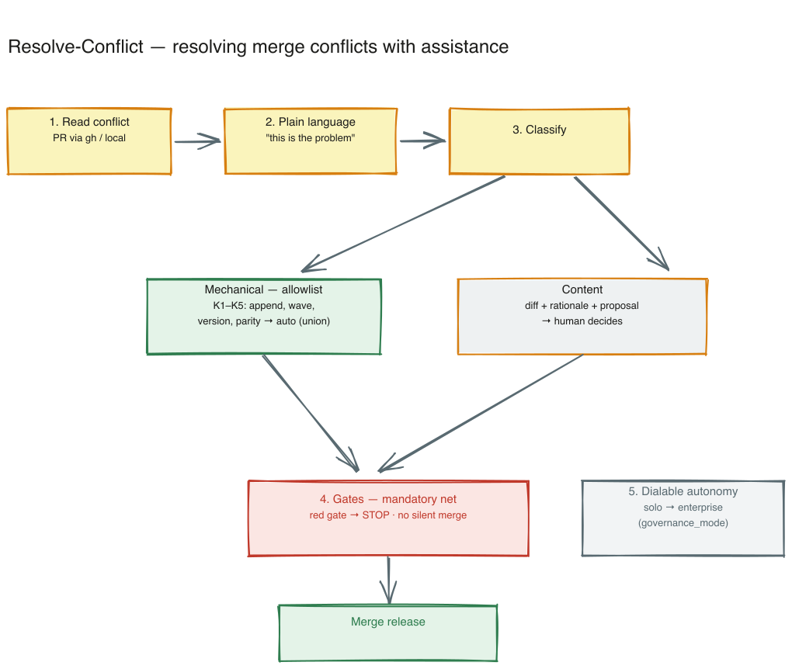

---
provenance:
  origin: ai-claude
  classification: open
  status: reviewed
---

# Resolve-Conflict — resolve merge conflicts with assistance

> 🇬🇧 **English** (this file) · 🇩🇪 [Deutsch](README.md)

> Reads a merge conflict (PR via `gh` or the local merge state), states the problem in plain language, auto-resolves **mechanical** conflicts via a vetted allowlist, and presents **content** conflicts with a recommendation only. Gates run before every release — no silent merge.

**Version:** 1.2.0 · **Command:** `/resolve-conflict`



---

## What problem does it solve?

Until now the framework had **no merge-conflict handling at all**: when `git merge --no-ff` hits a conflict, it silently falls back to "native Git, human resolves" ([`sprint-run/references/worktree-flow.md`](../sprint-run/references/worktree-flow.md) only governs "do not merge onto a dirty `main`"). The operator therefore re-prompts the same resolution again and again. This skill codifies the routine — and since **BOO-354** is the conflict handler `sprint-run` invokes in its rebase-before-merge step.

It is a **framework skill** (like `implement`/`goal`) because it is also shipped to the customer.

## What it does (6 steps)

1. **Read and name the conflict** — take in the PR resp. local merge state, evaluate the conflict markers, report "this is the problem" in **plain language**. **Layperson plain-language duty (BOO-372):** always start with an everyday-language picture (the Word-document analogy), separate "mechanical vs. you-must-decide" in layperson's words, and end every report with one clear next step.
2. **Resolve mechanical conflicts itself** — two-sided append lines, wave-index head, version bumps, formatting, DE/EN parity files. Only known, safe patterns (allowlist).
3. **Content conflicts with a recommendation only** — diff + rationale + proposal, never resolved on its own.
4. **Gates as a mandatory net** — the existing quality gates run before every release. No silent merge; a red gate = no release.
5. **Dialable autonomy** — solo may do more mechanical work automatically, enterprise less (via `governance_mode`).
6. **Plain language + log** — every auto-resolution is logged.

Details and the full class list: [`SKILL.en.md`](SKILL.en.md) · [`references/allowlist.en.md`](references/allowlist.en.md).

## Usage

```
/resolve-conflict            # local merge/rebase with conflict markers
/resolve-conflict <PR#>      # PR mode: gh pr checkout + read conflict
```

## Scope boundary

- **No conflict avoidance** — that is the collision-protection layers and BOO-353/BOO-354. See hub: [`docs/kollisionsschutz-drei-ebenen.md`](../docs/kollisionsschutz-drei-ebenen.md).
- **No auto-merge of content conflicts, never a silent merge.**

## Background

Grew out of the merge/isolation analysis of 2026-07-04 ([`docs/kollisionsschutz-drei-ebenen.md`](../docs/kollisionsschutz-drei-ebenen.md)) and the chat ideation. The recurring operator prompt "resolve the conflict the usual way" is lifted into a vetted routine.

## Files

```
resolve-conflict/
├── SKILL.md / SKILL.en.md         # workflow (6 steps), autonomy staging
├── README.md / README.en.md       # this overview
├── references/
│   ├── allowlist.md / .en.md      # SSoT: mechanically auto-resolvable classes K1–K5
├── overview.excalidraw / .png     # overview sketch (DE)
└── overview.en.excalidraw / .png  # overview sketch (EN)
```

## References

- Collision-protection hub: [`docs/kollisionsschutz-drei-ebenen.md`](../docs/kollisionsschutz-drei-ebenen.md)
- HANDBUCH **Appendix BC** · User FAQ §12 · Spec: [`specs/BOO-352.md`](../specs/BOO-352.md)
