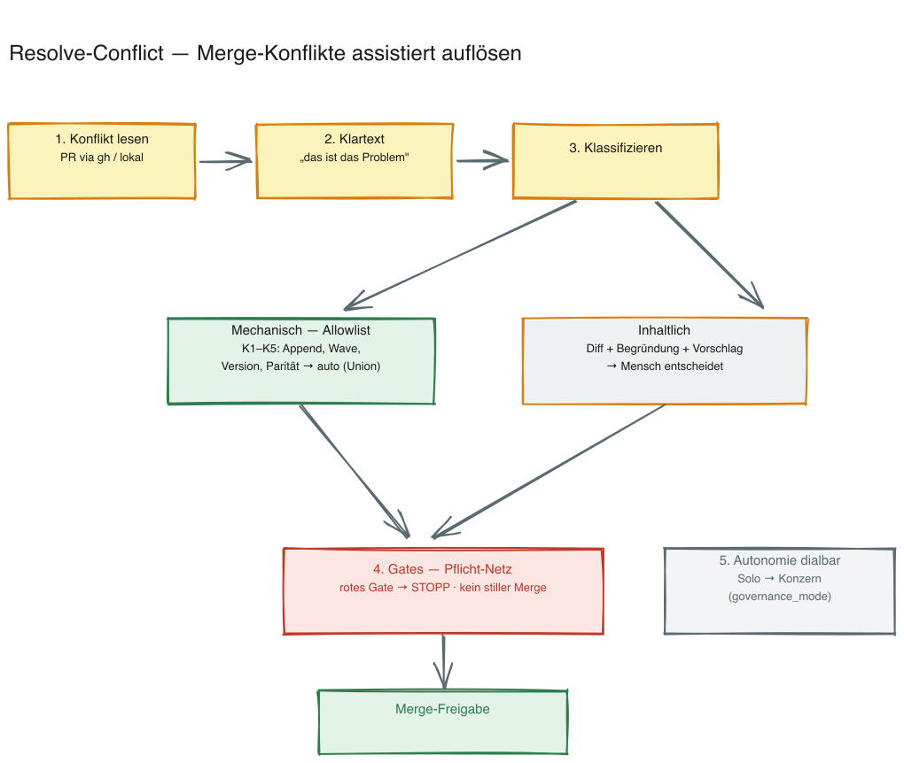

---
provenance:
  origin: ai-claude
  classification: open
  status: reviewed
---

# Resolve-Conflict — Merge-Konflikte assistiert auflösen

> 🇩🇪 **Deutsch** (diese Datei) · 🇬🇧 [English](README.en.md)

> Liest einen Merge-Konflikt (PR via `gh` oder lokaler Merge-Zustand), meldet das Problem in Klartext, löst **mechanische** Konflikte über eine geprüfte Allowlist selbst auf und legt **inhaltliche** nur mit Empfehlung vor. Gates laufen vor jeder Freigabe — kein stiller Merge.

**Version:** 1.2.0 · **Befehl:** `/resolve-conflict`



---

## Welches Problem löst er?

Das Framework hatte bisher **keinerlei Merge-Konflikt-Behandlung**: Trifft `git merge --no-ff` auf einen Konflikt, fällt es still auf «Git nativ, Mensch löst» zurück ([`sprint-run/references/worktree-flow.md`](../sprint-run/references/worktree-flow.md) regelt nur «nicht auf dirty `main` mergen»). Der Operator promptet deshalb wiederkehrend dieselbe Auflösung. Dieser Skill codifiziert die Routine — und ist seit **BOO-354** der Konflikt-Handler, den `sprint-run` im Rebase-vor-Merge-Schritt aufruft.

Er ist ein **Framework-Skill** (wie `implement`/`goal`), weil er auch an den Kunden ausgeliefert wird.

## Was er tut (6 Schritte)

1. **Konflikt lesen und benennen** — PR bzw. lokalen Merge-Zustand aufnehmen, Konfliktmarker auswerten, in **Klartext** melden «das ist das Problem». **Laien-Klartext-Pflicht (BOO-372):** immer zuerst ein bildliches Alltags-Beispiel (Word-Dokument-Analogie), «mechanisch vs. du-musst-entscheiden» in Laienworten, und jede Meldung endet mit einem klaren nächsten Schritt.
2. **Mechanische Konflikte selbst auflösen** — beidseitige Append-Zeilen, Wave-Index-Kopf, Versions-Bumps, Formatierung, DE/EN-Paritätsdateien. Nur bekannte, sichere Muster (Allowlist).
3. **Inhaltliche Konflikte nur mit Empfehlung** — Diff + Begründung + Vorschlag, nie selbst auflösen.
4. **Gates als Pflicht-Netz** — vor jeder Freigabe laufen die bestehenden Quality-Gates. Kein stiller Merge; rotes Gate = keine Freigabe.
5. **Autonomie dialbar** — Solo darf mehr mechanisch automatisch, Konzern weniger (an `governance_mode`).
6. **Klartext + Protokoll** — jede Auto-Auflösung wird geloggt.

Details und die vollständige Klassen-Liste: [`SKILL.md`](SKILL.md) · [`references/allowlist.md`](references/allowlist.md).

## Nutzung

```
/resolve-conflict            # lokaler Merge/Rebase mit Konfliktmarkern
/resolve-conflict <PR-Nr>    # PR-Modus: gh pr checkout + Konflikt lesen
```

## Abgrenzung

- **Keine Konflikt-Vermeidung** — das sind die Ebenen des Kollisionsschutzes und BOO-353/BOO-354. Siehe Hub: [`docs/kollisionsschutz-drei-ebenen.md`](../docs/kollisionsschutz-drei-ebenen.md).
- **Kein Auto-Merge inhaltlicher Konflikte, nie stiller Merge.**

## Hintergrund

Entstanden aus der Merge-/Isolations-Analyse vom 04.07. ([`docs/kollisionsschutz-drei-ebenen.md`](../docs/kollisionsschutz-drei-ebenen.md)) und der Ideation im Chat. Der wiederkehrende Operator-Prompt «löse den Konflikt so wie immer» wird zur geprüften Routine gehoben.

## Dateien

```
resolve-conflict/
├── SKILL.md / SKILL.en.md         # Workflow (6 Schritte), Autonomie-Staffelung
├── README.md / README.en.md       # diese Übersicht
├── references/
│   ├── allowlist.md / .en.md      # SSoT: mechanisch auto-auflösbare Klassen K1–K5
├── overview.excalidraw / .png     # Überblick-Sketch (DE)
└── overview.en.excalidraw / .png  # Überblick-Sketch (EN)
```

## Verweise

- Kollisionsschutz-Hub: [`docs/kollisionsschutz-drei-ebenen.md`](../docs/kollisionsschutz-drei-ebenen.md)
- HANDBUCH **Anhang BC** · User-FAQ §12 · Spec: [`specs/BOO-352.md`](../specs/BOO-352.md)
