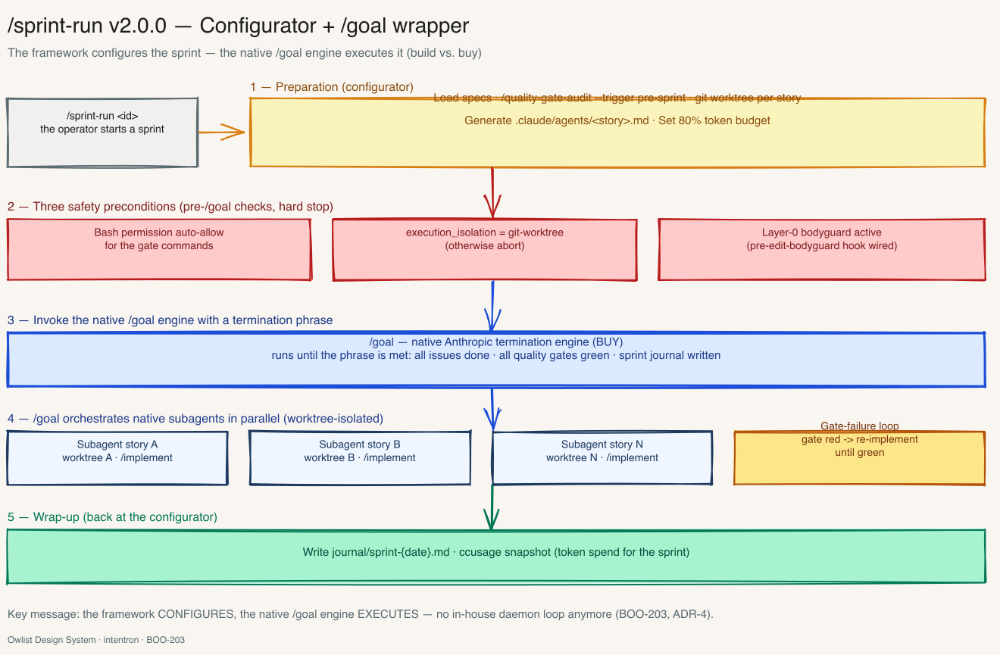
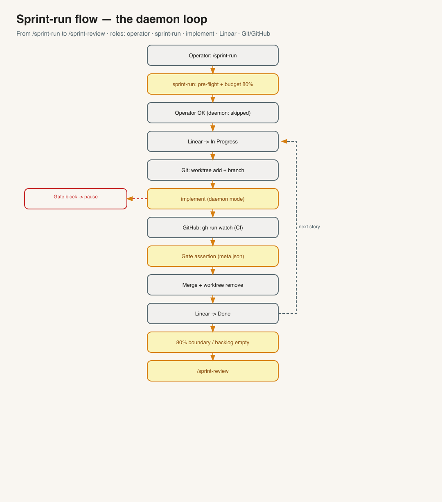
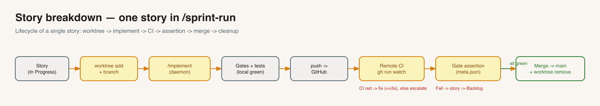
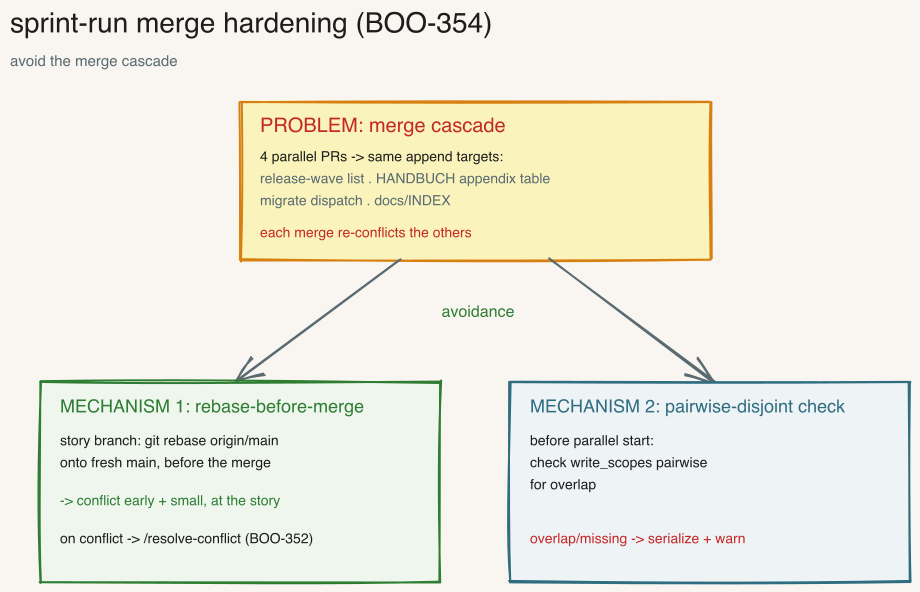

---
provenance:
  origin: ai-claude
  classification: open
  status: reviewed
---

<a name="english"></a>

> 🌐 **Language:** English (this file) · [🇩🇪 Deutsch](README.md)

# Sprint-Run — sprint configurator with /goal engine

> Prepares an **entire sprint** (pre-flight, specs, worktrees per story, subagent definitions,
> token budget) and hands execution over to the native termination engine **`/goal`**. `/goal`
> orchestrates the stories in parallel as native subagents (each in its own worktree) and runs
> until the termination phrase is satisfied: all issues *Done*, all quality gates green, sprint
> journal written. **Pure configurator + wrapper:** `/sprint-run` only calls the existing skills
> and does not change them.

**Version:** 2.5.1 · **Command:** `/sprint-run`

> **New in 2.5.1 (BOO-506):** merge gate sharpened (`references/worktree-flow.md`): "green" means the expected checks are **reported and green** — 0 reported checks are an error, not green (gate rule of thumb, HANDBUCH appendix BR §BR.5).



*A sprint at a glance. Full chapter with all diagrams: HANDBUCH [Appendix AD](../HANDBUCH.en.md). Excalidraw source: [`overview.en.excalidraw`](overview.en.excalidraw).*

---

## What does /sprint-run do?

A sprint consists of several stories. **Without** an orchestrator you do this by hand: call
`/implement`, select a story, wait, start the next one, update the status in Linear,
manage branches and worktrees yourself. That is tedious and error-prone.

`/sprint-run` automates exactly this mechanic. It is a **conductor**, not a soloist: it writes
no product code itself, but **prepares the sprint** and hands execution over to the native
termination engine **`/goal`** —

- **`/backlog`** selects and prioritizes the stories,
- **`/sprint-run`** prepares: pre-flight, worktrees per story, subagent definitions, budget,
- **`/goal`** orchestrates the stories in parallel as native subagents and runs until the
  termination phrase is satisfied,
- **`/sprint-review`** closes the sprint with lessons and metrics.

`/implement` (one story), `/backlog`, `/goal` and `/sprint-review` stay **unchanged** in the process.

> **Rule of thumb:** `/implement` = **one** story. `/sprint-run` = **an entire sprint** (many
> stories, executed by `/goal`). If you only want to build a single story, use `/implement` directly.
>
> **Breaking change 2.0.0 (ADR-4):** Up to 1.x `/sprint-run` was a hybrid container orchestrator
> with its own daemon loop. From 2.0.0 the container (Dockerfile, `devcontainer.json`, volume mount,
> lazy build), hybrid driver and skill-owned daemon loop are **gone** — replaced by native subagents
> under `/goal`. See "What is removed" further below.

---

## `/goal` as termination engine

`/goal` is the **native Anthropic termination engine**. It takes a **termination phrase** — a
machine-checkable description of sprint end — orchestrates native subagents and runs until an
evaluator sees the phrase as satisfied.

`/sprint-run` gives `/goal` two things: the **prepared environment** (worktrees, agent definitions,
budget) and the **phrase**, e.g.:

```
/goal "Sprint <id> closed: all Linear issues status:done, all quality gates green
(Semgrep, ESLint, Coverage>=80%, GitHub Actions), journal/sprint-<date>.md written,
no open subagent tasks"
```

The execution loop (worker fixes a red gate → gate again → evaluator checks → loop until green)
belongs to **`/goal`**, no longer to `/sprint-run`. A curated phrase library lives in
[`references/goal-termination-phrases.en.md`](references/goal-termination-phrases.en.md).

---

## Three safety prerequisites (before the `/goal` call)

Before `/sprint-run` starts `/goal`, three prerequisites **must** be met — otherwise `/goal` is not
called:

1. **Bash permission auto-allow.** `.claude/settings.local.json` carries an **allowlist** with the
   gate commands (`semgrep`, `eslint`, `pytest`, `gh run`, `git`) so that `/goal` and its subagents
   run the quality gates unattended without hanging on a permission prompt. `/bootstrap` creates the
   template.
2. **Worktree as safety boundary.** `execution_isolation` must be `git-worktree` — otherwise **abort**.
   Native subagents only write in parallel in worktree-isolated working trees without collisions.
3. **Layer-0 bodyguard active.** If the `pre-edit-bodyguard` hook is not live, the skill **pauses**
   with "Bodyguard not active" and does not call `/goal`.

These three replace the former container boundaries: worktree instead of container volume, allowlist
instead of container permissions, bodyguard instead of container sandbox.

---

## How a sprint runs



*Excalidraw source: [`docs/sprint-run-flow.en.excalidraw`](docs/sprint-run-flow.en.excalidraw).*

1. **Preparation & pre-flight.** `/sprint-run` reads the project settings and checks once:
   Is the backlog prioritized? Does every story have a complete spec (incl. subagent section)? Are
   the governance gates active? Is the tooling ready? If not → stop with a clear hint.
2. **Check safety prerequisites.** Allowlist present? `execution_isolation=git-worktree`? Bodyguard
   live? If one is missing → `/goal` is not started.
3. **Plan budget.** A sprint is **80% of the context window** (a "token box", not a time box).
   Stories are put into an order; whatever does not fit the budget moves to the next sprint.
4. **Prepare.** Create an own worktree (`git worktree`) per story and generate a
   `.claude/agents/<story>-<agent>.md` from the subagent section of the spec.
5. **Call `/goal`.** With the termination phrase. From here `/goal` orchestrates the stories in
   parallel as native subagents: run gates, on a red gate fix + re-check, on a sensitive path pause
   (operator answers, also remote), **gate assertion** before merge.
6. **Sprint end.** At 80% token (or empty backlog / satisfied phrase) `/goal` terminates.
   `/sprint-run` aggregates the sprint journal and calls `/sprint-review`.
7. **Report.** Final table: which stories *Done* / *Failed* / *Skipped*, token consumption, gate status.

---

## One story in detail



*Excalidraw source: [`docs/story-breakdown.en.excalidraw`](docs/story-breakdown.en.excalidraw).*

Every story goes through the same lifecycle — in its **own worktree** (`git worktree`),
so that parallel subagents don't get in each other's way: `/sprint-run` creates the worktree and
generates the subagent definition; `/goal` spawns the story subagent → local tests/linter → push →
remote tests ("CI") → **gate assertion** → merge to `main` → remove worktree. If something fails,
the worker agent fixes it and re-runs the gate; if it stays red, the story moves back into the backlog.

---

## Safety — three levels


*Excalidraw source: [`docs/gate-block-handling.en.excalidraw`](docs/gate-block-handling.en.excalidraw).*

Quality and governance are enforced on three levels — `/sprint-run` checks them before the call,
`/goal` enforces them during execution:

1. **Gate-block pause.** If a story touches sensitive paths (`sensitive-paths`) or personal
   data (`personal-data`), `/goal` **pauses** and notifies the operator. It continues
   only after explicit approval (`review-ok` / `privacy-ok`, also remote). **No** automatic bypass,
   **no** timeout resume.
2. **Gate assertion.** Before merging a story, `/goal` checks **by machine** based on the
   `meta.json` that no mandatory gate (linter, tests, security, coverage) was **silently** skipped.
   An unjustified skip → story back into the backlog. Ruleset:
   [`references/gate-assertion.en.md`](references/gate-assertion.en.md).
3. **Remote CI gate.** Merging happens **only** with green GitHub tests. If they stay red,
   the worker agent fixes it and re-runs the gate — **no** merge on red.
4. **Merge hardening (BOO-354).** Before the merge `/goal` rebases the story branch onto fresh
   `origin/main` (conflicts early + small, not late as a cascade; rebase conflict →
   [`/resolve-conflict`](../resolve-conflict/README.en.md)); and before the parallel start the
   pre-flight checks the `write_scopes` pairwise for overlap (missing/overlapping → serialize).
   Background: [HANDBUCH Appendix BI](../docs/handbuch/anhang-bi-sprint-run-merge-haertung.en.md).



*Excalidraw source: [`docs/merge-haertung.en.excalidraw`](docs/merge-haertung.en.excalidraw).*

---

## What is removed (ADR-4)

With 2.0.0 the following mechanisms from 1.x are **removed** — replaced by native subagents under
`/goal`:

| Removed (1.x) | Replacement (2.0.0) |
|---|---|
| Dockerfile + `devcontainer.json` | Worktree as safety boundary |
| Container lifecycle / lazy bootstrap | `/goal` spawns native subagents on demand |
| Hybrid driver approval mechanic | `/goal` pause on sensitive path |
| `/implement`-in-daemon-mode as container simulation | native subagents under `/goal` |
| Skill-owned daemon loop (`--auto`) | termination loop belongs to `/goal` |

In 2.0.0 there is **no** container and **no** skill-owned daemon loop anymore.

---

## Distinction from /implement

| | `/implement` | `/sprint-run` |
|---|---|---|
| Scope | **one** story | **N** stories (entire sprint) |
| Worktree | runs in the current tree | own `git worktree` + branch per story |
| Execution | direct | configures + hands over to `/goal` (native subagents) |
| Sprint end | — | 80% token boundary / satisfied phrase → `/sprint-review` |

---

## Prerequisites

In plain terms — three things must be present:

- **Git that can do "worktree".** Modern Git versions can do this out of the box. `/sprint-run` creates
  its own worktree per story so that parallel stories don't interfere with each other. (Check with
  `git worktree -h`.)
- **GitHub CLI logged in** (`gh auth login`). So that `/goal` can wait for the result of the
  GitHub tests after the push, before it merges.
- **The orchestrated skills are installed:** `/backlog` (selects stories), `/goal` (executes the
  stories), `/implement` (implements one story), `/quality-gate-audit` (pre-sprint gate) and
  `/sprint-review` (closes the sprint). `/sprint-run` only calls them — without them it does nothing.
- **`.claude/settings.local.json` with a gate allowlist** (created by `/bootstrap`) and
  `execution_isolation=git-worktree` in `CONVENTIONS.md` — both are prerequisites for the `/goal` call
  (see "Three safety prerequisites").

---

## How to get the skill

**Normal case — comes automatically.** When setting up a project with `/bootstrap` (or during a
framework update, see [`docs/runbooks/framework-update.md`](../docs/runbooks/framework-update.md))
`/sprint-run` is installed together with all skills. You don't need to do anything extra.

**Pull just this one skill** (e.g. on a machine without a full clone) — via
sparse-checkout, analogous to the bootstrap skill update:

```bash
cd /tmp
git clone --filter=blob:none --sparse https://github.com/Vibecoder79/intentron.git intentron
cd intentron && git sparse-checkout set sprint-run
cp -r sprint-run ~/.claude/skills/
cd /tmp && rm -rf intentron
```

---

## Configuration

| Field | Meaning | Default |
|---|---|---|
| `token_hard_threshold` | Sprint boundary in % of the context window (part of `/goal` termination) | `80` |
| `execution_isolation` | Must be `git-worktree` (safety prerequisite) | `git-worktree` |
| `worktree_strategy` | Isolation per story | `git-worktree` |
| `parallel_story_limit` | max. parallel story subagents under `/goal` (1 = sequential) | `1` |

---

## Trigger phrases

- `/sprint-run`
- "run the sprint"
- "drive the sprint"
- "automation-cycle"

---

## Related skills & docs

- **In-depth chapter with all 5 diagrams:** HANDBUCH [Appendix AD](../HANDBUCH.en.md) (incl. agent interaction
  and GitHub integration: [`docs/agent-interaction.en.png`](docs/agent-interaction.en.png) ·
  [`docs/github-integration.en.png`](docs/github-integration.en.png)).
- **Runbook (step by step with an example session):** [`docs/runbooks/sprint-run.en.md`](../docs/runbooks/sprint-run.en.md).
- **Orchestrated skills:** [`/backlog`](../backlog/README.en.md) · [`/goal`](../goal/README.en.md) · [`/implement`](../implement/README.en.md) · [`/quality-gate-audit`](../quality-gate-audit/README.en.md) · [`/sprint-review`](../sprint-review/README.en.md).
- **Skill definition (workflow in detail):** [`SKILL.md`](SKILL.en.md) · **References:** [`references/`](references/).
- **Manual E2E validation protocol:** [`references/goal-e2e-protocol.en.md`](references/goal-e2e-protocol.en.md)
  — with [`references/goal-e2e-fixture.en.md`](references/goal-e2e-fixture.en.md) (throwaway test project) and
  [`references/goal-e2e-journal-template.en.md`](references/goal-e2e-journal-template.en.md) (fill-in journal).

Chain: `intent → ideation → backlog → sprint-run → /goal ( native subagents )* → sprint-review`.

---

## File structure

```
sprint-run/
├── SKILL.md / SKILL.en.md                    ← Skill definition (workflow, gates)
├── README.md / README.en.md                  ← this file (+ DE)
├── overview.excalidraw / .png (+ .en)        ← Skill overview sketch
├── docs/                                      ← further sketches (flow, story, agent, GitHub, gate-block)
└── references/
    ├── orchestration-checklist.md   (+ .en.md)  ← Sprint pre-flight + pre-/goal checks
    ├── goal-termination-phrases.md  (+ .en.md)  ← Termination phrase library
    ├── goal-e2e-protocol.md         (+ .en.md)  ← Manual 1-story E2E protocol
    ├── goal-e2e-journal-template.md (+ .en.md)  ← Fill-in E2E journal (BOO-203 DoD reconciliation)
    ├── goal-e2e-fixture.md          (+ .en.md)  ← Throwaway test-project runsheet (story + gate failures)
    ├── gate-block-handling.md       (+ .en.md)  ← /goal pause/resume on sensitive path
    ├── gate-assertion.md            (+ .en.md)  ← Post-story gate assertion (meta.json)
    ├── worktree-flow.md             (+ .en.md)  ← Worktree per story
    └── token-boundary.md            (+ .en.md)  ← 80% boundary as part of /goal termination
```
