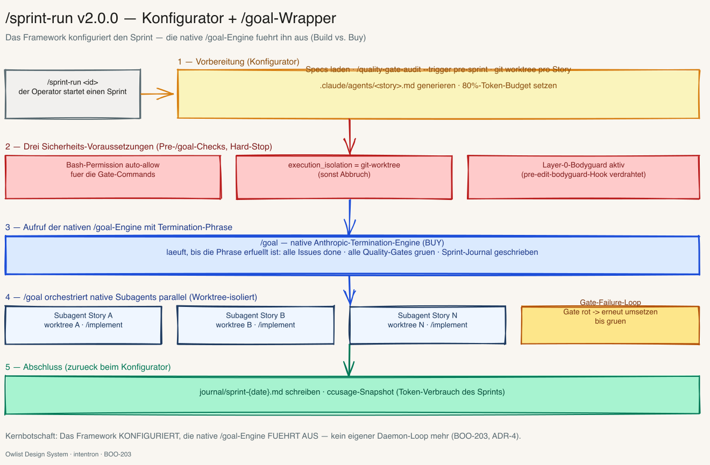
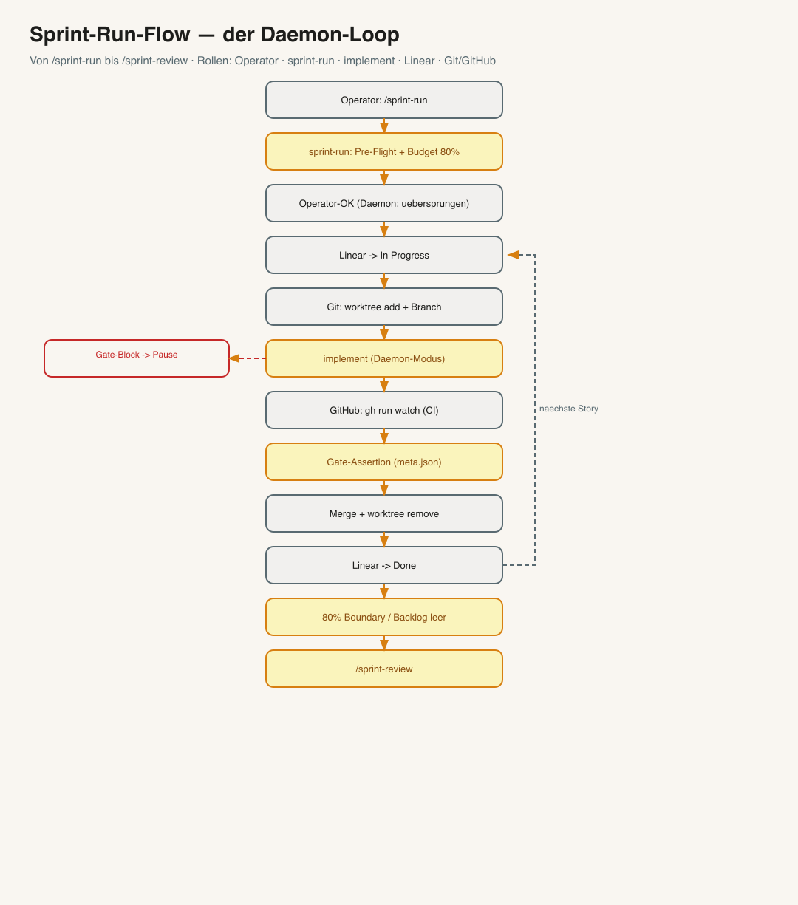
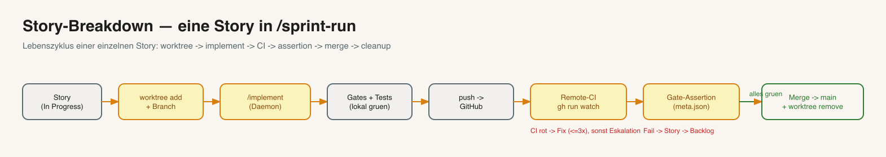
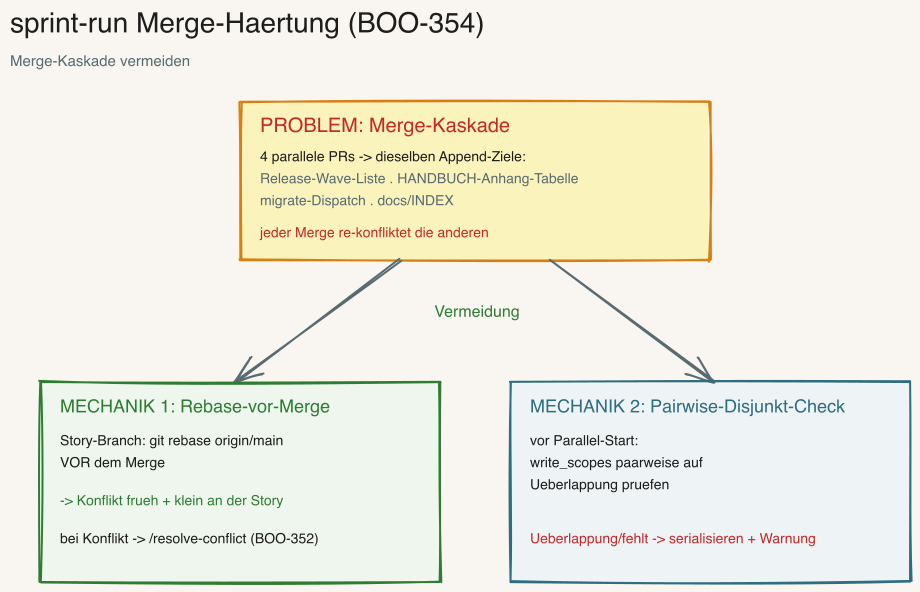

---
provenance:
  origin: ai-claude
  classification: open
  status: reviewed
---

<a name="deutsch"></a>

> 🌐 **Sprache:** Deutsch (diese Datei) · [🇬🇧 English version](README.en.md)

# Sprint-Run — Sprint-Konfigurator mit /goal-Engine

> Bereitet einen **ganzen Sprint** vor (Pre-Flight, Specs, Worktrees pro Story,
> Subagent-Definitionen, Token-Budget) und uebergibt die Ausfuehrung an die native
> Termination-Engine **`/goal`**. `/goal` orchestriert die Stories parallel als native Subagents
> (jede in ihrem eigenen Arbeitsordner) und laeuft, bis die Termination-Phrase erfuellt ist:
> alle Issues *Done*, alle Quality-Gates gruen, Sprint-Journal geschrieben. **Reiner
> Konfigurator + Wrapper:** `/sprint-run` ruft die bestehenden Skills nur auf und veraendert sie nicht.

**Version:** 2.5.1 · **Befehl:** `/sprint-run`

> **Neu in 2.5.1 (BOO-506):** Merge-Gate präzisiert (`references/worktree-flow.md`): «grün» heisst erwartete Checks **gemeldet und grün** — 0 gemeldete Checks sind ein Fehler, kein Grün (Gate-Faustregel, HANDBUCH Anhang BR §BR.5).



*Ein Sprint auf einen Blick. Volles Kapitel mit allen Diagrammen: HANDBUCH [Anhang AD](../HANDBUCH.md). Excalidraw-Quelle: [`overview.excalidraw`](overview.excalidraw).*

---

## Was macht /sprint-run?

Ein Sprint besteht aus mehreren Stories. **Ohne** Orchestrator macht man das von Hand: `/implement`
aufrufen, eine Story auswaehlen, warten, die naechste starten, in Linear den Status nachziehen,
Branches und Arbeitsordner selbst verwalten. Das ist stupide und fehleranfaellig.

`/sprint-run` automatisiert genau diese Mechanik. Es ist ein **Dirigent**, kein Solist: es schreibt
selbst keinen Produktcode, sondern **bereitet den Sprint vor** und uebergibt die Ausfuehrung an die
native Termination-Engine **`/goal`** —

- **`/backlog`** waehlt und priorisiert die Stories,
- **`/sprint-run`** bereitet vor: Pre-Flight, Worktrees pro Story, Subagent-Definitionen, Budget,
- **`/goal`** orchestriert die Stories parallel als native Subagents und laeuft, bis die
  Termination-Phrase erfuellt ist,
- **`/sprint-review`** schliesst den Sprint mit Lessons und Metriken ab.

`/implement` (eine Story), `/backlog`, `/goal` und `/sprint-review` bleiben dabei **unveraendert**.

> **Faustregel:** `/implement` = **eine** Story. `/sprint-run` = **ein ganzer Sprint** (viele Stories,
> ausgefuehrt von `/goal`). Wer nur eine einzelne Story bauen will, nimmt `/implement` direkt.
>
> **Breaking Change 2.0.0 (ADR-4):** Bis 1.x war `/sprint-run` ein Hybrid-Container-Orchestrator mit
> eigenem Daemon-Loop. Ab 2.0.0 sind Container (Dockerfile, `devcontainer.json`, Volume-Mount,
> Lazy-Build), Hybrid-Driver und der skill-eigene Daemon-Loop **entfallen** — ersetzt durch native
> Subagents unter `/goal`. Siehe „Was entfaellt" weiter unten.

---

## `/goal` als Termination-Engine

`/goal` ist die **native Anthropic-Termination-Engine**. Sie nimmt eine **Termination-Phrase**
entgegen — eine maschinell pruefbare Beschreibung des Sprint-Endes — orchestriert native Subagents
und laeuft so lange, bis ein Evaluator die Phrase als erfuellt sieht.

`/sprint-run` liefert `/goal` zwei Dinge: die **vorbereitete Umgebung** (Worktrees,
Agent-Definitionen, Budget) und die **Phrase**, z. B.:

```
/goal "Sprint <id> closed: alle Linear-Issues status:done, alle Quality-Gates grün
(Semgrep, ESLint, Coverage>=80%, GitHub Actions), journal/sprint-<date>.md geschrieben,
keine offenen Subagent-Tasks"
```

Die Ausfuehrungs-Schleife (Worker fixt ein rotes Gate → Gate erneut → Evaluator prueft → Loop bis
gruen) gehoert **`/goal`**, nicht mehr `/sprint-run`. Eine kuratierte Phrasen-Bibliothek liegt in
[`references/goal-termination-phrases.md`](references/goal-termination-phrases.md).

---

## Drei Sicherheits-Voraussetzungen (vor dem `/goal`-Aufruf)

Bevor `/sprint-run` `/goal` startet, **muessen** drei Voraussetzungen erfuellt sein — sonst wird
`/goal` nicht aufgerufen:

1. **Bash-Permission auto-allow.** `.claude/settings.local.json` traegt eine **Allowlist** mit den
   Gate-Commands (`semgrep`, `eslint`, `pytest`, `gh run`, `git`), damit `/goal` und seine Subagents
   die Quality-Gates unbeaufsichtigt fahren, ohne an einem Permission-Prompt haengenzubleiben. Das
   Template legt `/bootstrap` an.
2. **Worktree als Sicherheits-Boundary.** `execution_isolation` muss `git-worktree` sein — sonst
   **Abbruch**. Native Subagents schreiben nur in Worktree-isolierten Arbeitsbaeumen kollisionsfrei
   parallel.
3. **Layer-0 Bodyguard aktiv.** Ist der `pre-edit-bodyguard`-Hook nicht live, **pausiert** der Skill
   mit „Bodyguard nicht aktiv" und ruft `/goal` nicht auf.

Diese drei ersetzen die frueheren Container-Boundaries: Worktree statt Container-Volume, Allowlist
statt Container-Permissions, Bodyguard statt Container-Sandbox.

---

## So laeuft ein Sprint



*Excalidraw-Quelle: [`docs/sprint-run-flow.excalidraw`](docs/sprint-run-flow.excalidraw).*

1. **Vorbereitung & Pre-Flight.** `/sprint-run` liest die Projekt-Einstellungen und prueft einmalig:
   Ist der Backlog priorisiert? Hat jede Story eine vollstaendige Spec (inkl. Subagent-Sektion)?
   Sind die Governance-Gates aktiv? Ist das Werkzeug bereit? Wenn nein → Stopp mit klarem Hinweis.
2. **Sicherheits-Voraussetzungen pruefen.** Allowlist da? `execution_isolation=git-worktree`? Bodyguard
   live? Fehlt eines → `/goal` wird nicht gestartet.
3. **Budget planen.** Ein Sprint ist **80 % des Context-Windows** (eine „Token-Box", keine Zeit-Box).
   Stories werden in eine Reihenfolge gebracht; was nicht ins Budget passt, wandert in den naechsten Sprint.
4. **Vorbereiten.** Pro Story einen eigenen Arbeitsordner (`git worktree`) anlegen und aus der
   Subagent-Sektion der Spec eine `.claude/agents/<story>-<agent>.md` generieren.
5. **`/goal` aufrufen.** Mit der Termination-Phrase. Ab hier orchestriert `/goal` die Stories
   parallel als native Subagents: Gates fahren, bei rotem Gate fixen + erneut pruefen, bei
   Sensitive-Path pausieren (Operator antwortet, auch Remote), **Gate-Assertion** vor Merge.
6. **Sprint-Ende.** Bei 80 % Token (oder leerem Backlog / erfuellter Phrase) terminiert `/goal`.
   `/sprint-run` aggregiert das Sprint-Journal und ruft `/sprint-review`.
7. **Report.** Abschlusstabelle: welche Stories *Done* / *Failed* / *Skipped*, Token-Verbrauch, Gate-Status.

---

## Eine Story im Detail



*Excalidraw-Quelle: [`docs/story-breakdown.excalidraw`](docs/story-breakdown.excalidraw).*

Jede Story durchlaeuft denselben Lebenszyklus — in einem **eigenen Arbeitsordner** (`git worktree`),
damit sich parallele Subagents nicht in die Quere kommen: `/sprint-run` legt den Arbeitsordner an
und generiert die Subagent-Definition; `/goal` spawnt den Story-Subagent → lokale Tests/Linter →
Push → Remote-Tests („CI") → **Gate-Assertion** → Merge nach `main` → Arbeitsordner entfernen.
Schlaegt etwas fehl, fixt der Worker-Agent und faehrt das Gate erneut; bleibt es rot, wandert die
Story zurueck in den Backlog.

---

## Sicherheit — drei Ebenen


*Excalidraw-Quelle: [`docs/gate-block-handling.excalidraw`](docs/gate-block-handling.excalidraw).*

Qualitaet und Governance werden auf drei Ebenen durchgesetzt — `/sprint-run` prueft sie vor dem
Aufruf, `/goal` setzt sie waehrend der Ausfuehrung durch:

1. **Gate-Block-Pause.** Beruehrt eine Story sensible Pfade (`sensitive-paths`) oder personenbezogene
   Daten (`personal-data`), **pausiert** `/goal` und benachrichtigt den Operator. Weiter geht es
   nur nach ausdruecklicher Freigabe (`review-ok` / `privacy-ok`, auch Remote). **Kein** automatischer
   Bypass, **kein** Timeout-Resume.
2. **Gate-Assertion.** Vor dem Merge einer Story prueft `/goal` **maschinell** anhand der
   `meta.json`, dass kein Pflicht-Gate (Linter, Tests, Security, Coverage) **still** uebersprungen
   wurde. Ein unbegruendeter Skip → Story zurueck in den Backlog. Regelwerk:
   [`references/gate-assertion.md`](references/gate-assertion.md).
3. **Remote-CI-Gate.** Zusammengefuehrt wird **nur** bei gruenen GitHub-Tests. Bleiben sie rot,
   fixt der Worker-Agent und fahrt das Gate erneut — **kein** Merge auf Rot.
4. **Merge-Haertung (BOO-354).** Vor dem Merge rebased `/goal` den Story-Branch auf frisches
   `origin/main` (Konflikte frueh + klein, nicht spaet als Kaskade; Rebase-Konflikt →
   [`/resolve-conflict`](../resolve-conflict/README.md)); und vor dem Parallel-Start prueft der
   Pre-Flight die `write_scopes` paarweise auf Ueberlappung (fehlend/ueberlappend → serialisieren).
   Hintergrund: [HANDBUCH Anhang BI](../docs/handbuch/anhang-bi-sprint-run-merge-haertung.md).



*Excalidraw-Quelle: [`docs/merge-haertung.excalidraw`](docs/merge-haertung.excalidraw).*

---

## Was entfaellt (ADR-4)

Mit 2.0.0 **entfallen** folgende Mechanismen aus 1.x — sie sind durch native Subagents unter `/goal`
ersetzt:

| Entfaellt (1.x) | Ersatz (2.0.0) |
|---|---|
| Dockerfile + `devcontainer.json` | Worktree als Sicherheits-Boundary |
| Container-Lifecycle / Lazy-Bootstrap | `/goal` spawnt native Subagents on demand |
| Hybrid-Driver-Approval-Mechanik | `/goal`-Pause bei Sensitive-Path |
| `/implement`-im-Daemon-Modus als Container-Simulation | native Subagents unter `/goal` |
| Skill-eigener Daemon-Loop (`--auto`) | Termination-Loop gehoert `/goal` |

In 2.0.0 gibt es **keinen** Container und **keinen** skill-eigenen Daemon-Loop mehr.

---

## Abgrenzung zu /implement

| | `/implement` | `/sprint-run` |
|---|---|---|
| Umfang | **eine** Story | **N** Stories (ganzer Sprint) |
| Arbeitsordner | laeuft im aktuellen Baum | eigener `git worktree` + Branch pro Story |
| Ausfuehrung | direkt | konfiguriert + uebergibt an `/goal` (native Subagents) |
| Sprint-Ende | — | 80%-Token-Boundary / erfuellte Phrase → `/sprint-review` |

---

## Voraussetzungen

In Klartext — drei Dinge muessen vorhanden sein:

- **Git, das „worktree" kann.** Moderne Git-Versionen koennen das von Haus aus. `/sprint-run` legt
  pro Story einen eigenen Arbeitsordner an, damit sich parallele Stories nicht stoeren. (Pruefen mit
  `git worktree -h`.)
- **GitHub-CLI angemeldet** (`gh auth login`). Damit `/goal` nach dem Push auf das Ergebnis der
  GitHub-Tests warten kann, bevor es zusammenfuehrt.
- **Die gesteuerten Skills sind installiert:** `/backlog` (waehlt Stories), `/goal` (fuehrt die
  Stories aus), `/implement` (setzt eine Story um), `/quality-gate-audit` (Pre-Sprint-Gate) und
  `/sprint-review` (schliesst den Sprint ab). `/sprint-run` ruft sie nur auf — ohne sie tut es nichts.
- **`.claude/settings.local.json` mit Gate-Allowlist** (von `/bootstrap` angelegt) und
  `execution_isolation=git-worktree` in `CONVENTIONS.md` — beides ist Voraussetzung fuer den
  `/goal`-Aufruf (siehe „Drei Sicherheits-Voraussetzungen").

---

## So bekommst du den Skill

**Normalfall — kommt automatisch.** Beim Einrichten eines Projekts mit `/bootstrap` (oder beim
Framework-Update, siehe [`docs/runbooks/framework-update.md`](../docs/runbooks/framework-update.md))
wird `/sprint-run` zusammen mit allen Skills installiert. Du musst nichts extra tun.

**Nur diesen einen Skill nachziehen** (z. B. auf einer Maschine ohne vollen Klon) — per
sparse-checkout, analog zum Bootstrap-Skill-Update:

```bash
cd /tmp
git clone --filter=blob:none --sparse https://github.com/Vibecoder79/intentron.git intentron
cd intentron && git sparse-checkout set sprint-run
cp -r sprint-run ~/.claude/skills/
cd /tmp && rm -rf intentron
```

---

## Konfiguration

| Feld | Bedeutung | Default |
|---|---|---|
| `token_hard_threshold` | Sprint-Boundary in % des Context-Windows (Teil der `/goal`-Termination) | `80` |
| `execution_isolation` | Muss `git-worktree` sein (Sicherheits-Voraussetzung) | `git-worktree` |
| `worktree_strategy` | Isolation pro Story | `git-worktree` |
| `parallel_story_limit` | max. parallele Story-Subagents unter `/goal` (1 = sequentiell) | `1` |

---

## Trigger-Phrasen

- `/sprint-run`
- "Sprint laufen lassen"
- "fahr den Sprint"
- "automation-cycle"

---

## Verwandte Skills & Doku

- **Tiefen-Kapitel mit allen 5 Diagrammen:** HANDBUCH [Anhang AD](../HANDBUCH.md) (inkl. Agent-Interaktion
  und GitHub-Integration: [`docs/agent-interaction.png`](docs/agent-interaction.png) ·
  [`docs/github-integration.png`](docs/github-integration.png)).
- **Runbook (Schritt-fuer-Schritt mit Beispiel-Session):** [`docs/runbooks/sprint-run.md`](../docs/runbooks/sprint-run.md).
- **Gesteuerte Skills:** [`/backlog`](../backlog/README.md) · [`/goal`](../goal/README.md) · [`/implement`](../implement/README.md) · [`/quality-gate-audit`](../quality-gate-audit/README.md) · [`/sprint-review`](../sprint-review/README.md).
- **Skill-Definition (Workflow im Detail):** [`SKILL.md`](SKILL.md) · **Referenzen:** [`references/`](references/).
- **Manuelles E2E-Validierungs-Protokoll:** [`references/goal-e2e-protocol.md`](references/goal-e2e-protocol.md)
  — mit [`references/goal-e2e-fixture.md`](references/goal-e2e-fixture.md) (Wegwerf-Test-Projekt) und
  [`references/goal-e2e-journal-template.md`](references/goal-e2e-journal-template.md) (ausfuellbares Journal).

Kette: `intent → ideation → backlog → sprint-run → /goal ( native Subagents )* → sprint-review`.

---

## Dateistruktur

```
sprint-run/
├── SKILL.md / SKILL.en.md                    ← Skill-Definition (Workflow, Gates)
├── README.md / README.en.md                  ← diese Datei (+ EN)
├── overview.excalidraw / .png (+ .en)        ← Skill-Overview-Sketch
├── docs/                                      ← weitere Sketches (Flow, Story, Agent, GitHub, Gate-Block)
└── references/
    ├── orchestration-checklist.md   (+ .en.md)  ← Sprint-Pre-Flight + Pre-/goal-Checks
    ├── goal-termination-phrases.md  (+ .en.md)  ← Termination-Phrasen-Bibliothek
    ├── goal-e2e-protocol.md         (+ .en.md)  ← Manuelles 1-Story-E2E-Protokoll
    ├── goal-e2e-journal-template.md (+ .en.md)  ← Ausfuellbares E2E-Journal (DoD-Abgleich BOO-203)
    ├── goal-e2e-fixture.md          (+ .en.md)  ← Wegwerf-Test-Projekt-Runsheet (Story + Gate-Failures)
    ├── gate-block-handling.md       (+ .en.md)  ← /goal-Pause/Resume bei Sensitive-Path
    ├── gate-assertion.md            (+ .en.md)  ← Post-Story-Gate-Assertion (meta.json)
    ├── worktree-flow.md             (+ .en.md)  ← Arbeitsordner pro Story
    └── token-boundary.md            (+ .en.md)  ← 80%-Boundary als Teil der /goal-Termination
```
