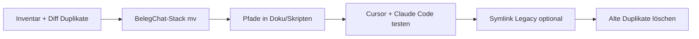

# Pfad-Migration: Shared → ~/Entwicklung

> **Stand:** 2026-07-11 · Prüfung vor Post-Alpha-Umsetzung  
> **Ziel:** Projekte aus `/Users/Shared/Entwicklung/projekte/` nach `~/Entwicklung/projekte/` verlagern.

## Ergebnis der Prüfung

**Verschieben ist möglich**, aber nicht blind `mv` — es gibt **Duplikate**, **drei n8n-Pfade** und **~25 hardcodierte Absolute Pfade** in Doku/Skripten.

### Zwei verschiedene Bäume (nicht verwechseln!)

| Pfad | Bedeutung | Owner |
|------|-----------|-------|
| `~/Entwicklung` | Symlink → `/Users/Shared/Projekte/Entwicklung` | kunkel |
| `~/Entwicklung/projekte/` | **Ziel** laut `cursor-workspaces.txt` | kunkel:staff |
| `/Users/Shared/Entwicklung/projekte/` | **Aktueller** BelegChat-Workspace | Parent `hpcn`, Repos meist `kunkel` |

BelegChat-Arbeit läuft heute im **Shared-Zweig**, nicht in `~/Entwicklung/projekte/`.

---

## BelegChat-Stack — Was wohin?

| Repo | Shared | Home (`~/Entwicklung/projekte`) | Empfehlung |
|------|--------|----------------------------------|------------|
| **belegchat** | ✓ aktuell (docs, POST-ALPHA-PLAN, Alpha) | `belegchat-project` — **veraltet** | **Shared → Home als `belegchat`**; `belegchat-project` löschen |
| **threema-decrypt** | ✓ nur hier | — | Verschieben |
| **n8n-workflows** | ✓ `projekte/n8n-workflows` (neueste Scripts) | — | Verschieben; Duplikate bereinigen |
| **berent-2nd-brain** | ✓ nur hier | — | Verschieben (oder `~/BERENT-2nd-Brain` laut MIGRATION.md) |

### n8n — drei Kopien (konsolidieren!)

| Pfad | Stand |
|------|-------|
| `/Users/Shared/Entwicklung/projekte/n8n-workflows` | **Kanonisch** (fix-*.mjs, Jul 2026) |
| `/Users/Shared/Entwicklung/n8n-workflows` | Älter (Mär 2026) |
| `/Users/Shared/n8n-workflows` | Symlink-Ziel von `~/Entwicklung/n8n Workflows` |

→ Eine Quelle behalten, andere nach Abgleich **archivieren/löschen**.

### Duplikate in beiden Bäumen

| Name | Aktion |
|------|--------|
| `belegchat` / `belegchat-project` | Shared behalten, Home-Stub löschen |
| `belegchat-landing` | Diff, neuere Version behalten |
| `vaaas` / `vaaas-roi-calculator` | Prüfen, zusammenführen |
| `textschmiede-5tc` / `textschmiede-5TC` | Case-Duplikat prüfen |

### Nur in Shared (28 Projekte) — Kandidaten für Migration

u.a. `belegchat`, `threema-decrypt`, `n8n-workflows`, `berent-2nd-brain`, `nr7`, `berent.ai`, `n8n-macos-setup`

### Nur in Home — bleiben oder nachziehen

`asset-library`, `berentai`, `RPGLE_*`, `VAaaS-ROI-Rechner` — bereits am Zielort.

---

## Abhängigkeiten beim Verschieben

| Was bricht | Wo hardcodiert | Fix |
|------------|----------------|-----|
| Claude Code `cd` | `POST-ALPHA-PLAN.md`, `CLAUDE.md`, Vault | Pfade auf `~/Entwicklung/projekte/` |
| n8n patch scripts | `n8n-workflows/scripts/fix-*.mjs` (15×) | `BERENT_ROOT` Env oder relativer Pfad |
| Second-Brain-Sync | `docs/vault/README.md`, `set-2nd-brain-permissions.sh` | Zielpfad anpassen |
| Cursor Workspace | `/Users/Shared/Entwicklung/projekte` | Auf `~/Entwicklung/projekte` umstellen |
| hpcn Mac2 | evtl. Shared-Pfade | Übergangs-Symlink oder Git-only |

**Git:** Remote-URLs bleiben gleich — `git mv` bzw. `mv` + `git status` reicht.

**Nicht verschieben:** `node_modules/`, `.next/` — nach Move `npm install` / `npm run build`.

---

## Migrationsablauf (Phase 0)



### Schritt-für-Schritt (BelegChat zuerst)

**Skript (empfohlen):**

```bash
cd /Users/Shared/Entwicklung/projekte/belegchat   # oder nach Move: ~/Entwicklung/projekte/belegchat

# 1. Vorschau
./scripts/migrate-to-home-entwicklung.sh --dry-run

# 2. Ausführen (verschieben + Pfade ersetzen + optional Symlinks + Stub löschen)
./scripts/migrate-to-home-entwicklung.sh --yes --symlinks --remove-stub --fix-permissions
```

**Manuell** (falls Skript nicht genutzt wird):

1. **Backup:** `git status` clean in allen Repos
2. **Verschieben:**
   ```bash
   mv /Users/Shared/Entwicklung/projekte/belegchat ~/Entwicklung/projekte/
   mv /Users/Shared/Entwicklung/projekte/threema-decrypt ~/Entwicklung/projekte/
   mv /Users/Shared/Entwicklung/projekte/n8n-workflows ~/Entwicklung/projekte/
   mv /Users/Shared/Entwicklung/projekte/berent-2nd-brain ~/Entwicklung/projekte/
   ```
3. **Übergang (optional, 2 Wochen):**
   ```bash
   ln -s ~/Entwicklung/projekte/belegchat /Users/Shared/Entwicklung/projekte/belegchat
   ```
4. **Pfade aktualisieren** in `CLAUDE.md`, `POST-ALPHA-PLAN.md`, Vault, n8n-Scripts
5. **Cursor:** Workspace-Root `~/Entwicklung/projekte/belegchat`
6. **Löschen:** `~/Entwicklung/projekte/belegchat-project` (nach Diff)
7. **n8n-Duplikate:** ältere `Shared/Entwicklung/n8n-workflows` archivieren

### DoD Phase 0

- [ ] `cd ~/Entwicklung/projekte/belegchat && cat CLAUDE.md` — Claude Code startet
- [ ] n8n patch script läuft mit neuem Pfad
- [ ] Vault-Sync zu berent-2nd-brain funktioniert
- [ ] Kein aktiver Workspace zeigt mehr auf leere Shared-Pfade

---

## Empfehlung für Claude Code

**Phase 0 vor Phase 1 (GoBD)** — sonst werden neue Migrationen/Pfade wieder im Legacy-Ordner angelegt.

Canonical Root ab dann:

```
~/Entwicklung/projekte/     # = /Users/Shared/Projekte/Entwicklung/Projekte/
├── belegchat/
├── threema-decrypt/
├── n8n-workflows/
└── berent-2nd-brain/
```

---

## hpcn-Zugang

`cursor-workspaces.txt` sieht `staff`-Gruppe + `g+rwX` auf `~/Entwicklung/projekte` vor. Nach Move: `chown kunkel:staff`, `chmod g+rwX`, SetGID auf Verzeichnissen — analog `set-2nd-brain-permissions.sh`.
